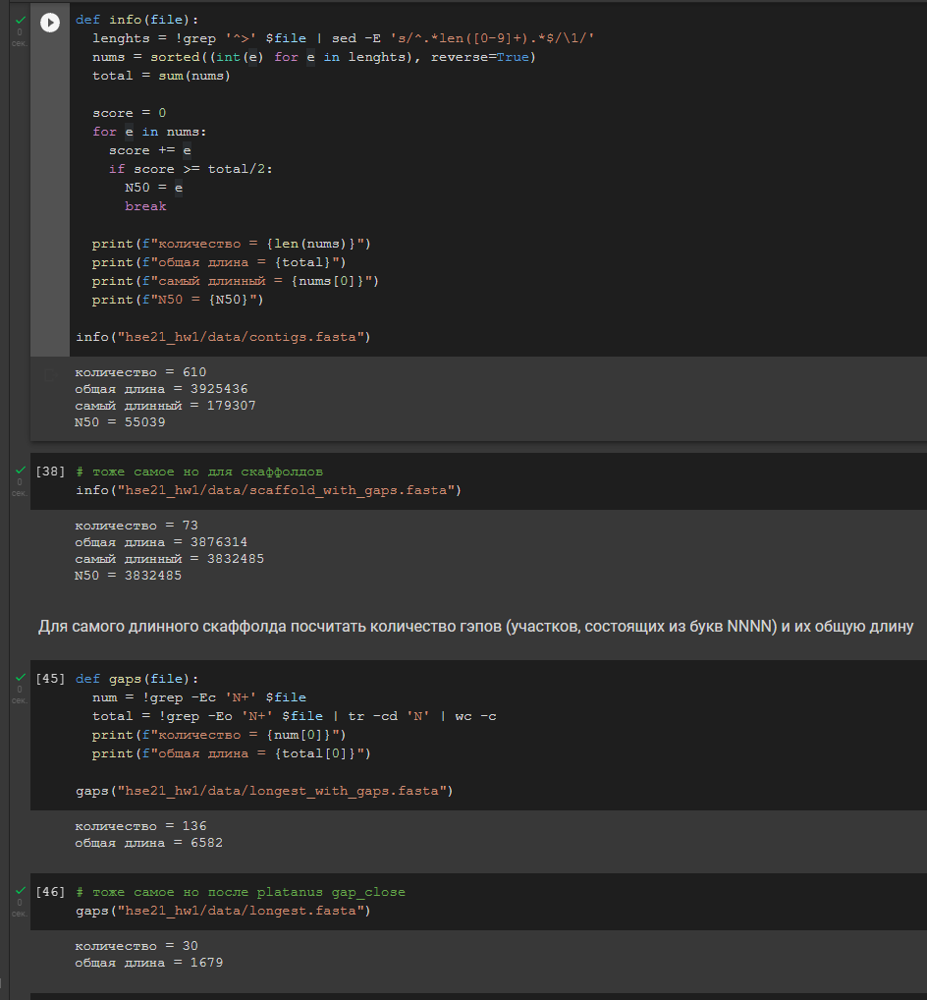

# Домашнее задание №1
###### Котся Борисов БПИ197

## Задание №1
[Список](https://github.com/Cortan122/hse21_hw1/blob/master/src/assembly.sh) комнад, которые были выполнены на сервере:
```bash
Fastqc() {
  rm -rf fastqc multiqc
  mkdir fastqc multiqc
  fastqc "$@" -o fastqc
  multiqc fastqc -o multiqc
}

mkdir data
cd data
ln --symbolic /usr/share/data-minor-bioinf/assembly/oil* .

SEED=503
seqtk sample -s$SEED oil_R1.fastq 5000000 > sub1.fastq
seqtk sample -s$SEED oil_R2.fastq 5000000 > sub2.fastq
seqtk sample -s$SEED oilMP_S4_L001_R1_001.fastq 1500000 > mp1.fastq
seqtk sample -s$SEED oilMP_S4_L001_R2_001.fastq 1500000 > mp2.fastq

Fastqc sub*.fastq mp*.fastq

platanus_trim sub*.fastq
platanus_internal_trim mp*.fastq
rm mp*.fastq sub*.fastq

Fastqc *trimmed

platanus assemble -f *.trimmed
platanus scaffold -c out_contig.fa -IP1 *.trimmed -OP2 *.int_trimmed
platanus gap_close -c out_scaffold.fa -IP1 *.trimmed -OP2 *.int_trimmed
rm *trimmed

sed -n '1,/^>/p' scaffold.fasta | head -n -1 >longest.fasta
```

## Отчёты multiQC
### Для исходных чтений
Ссылка: https://cortan122.github.io/hse21_hw1/multiqc.html


### Для подрезанных чтений
Ссылка: https://cortan122.github.io/hse21_hw1/multiqc_trimmed.html


## Код на питоне
Ссылка на Google colab: https://colab.research.google.com/drive/1l2AZD2vk311N0KWL_gtszP2ftFk1_sOz

```python
def info(file):
  lenghts = !grep '^>' $file | sed -E 's/^.*len([0-9]+).*$/\1/'
  nums = sorted((int(e) for e in lenghts), reverse=True)
  total = sum(nums)

  score = 0
  for e in nums:
    score += e
    if score >= total/2:
      N50 = e
      break

  print(f"количество = {len(nums)}")
  print(f"общая длина = {total}")
  print(f"самый длинный = {nums[0]}")
  print(f"N50 = {N50}")
```

```python
def gaps(file):
  num = !grep -Ec 'N+' $file
  total = !grep -Eo 'N+' $file | tr -cd 'N' | wc -c
  print(f"количество = {num[0]}")
  print(f"общая длина = {total[0]}")
```



